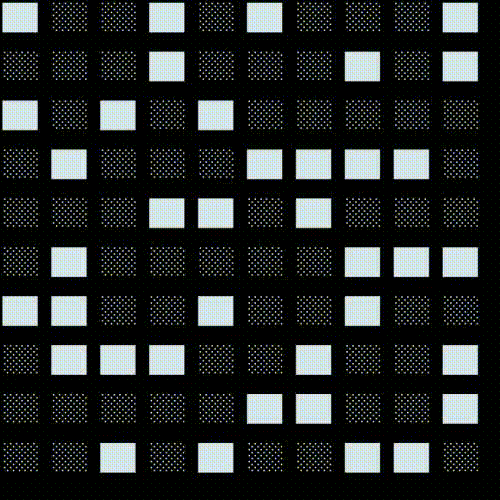

# Game-of-Life

 The **Game of Life**, also known simply as **Life**, is a [cellular automaton](https://en.wikipedia.org/wiki/Cellular_automaton "Cellular automaton") devised by the British [mathematician](https://en.wikipedia.org/wiki/Mathematician "Mathematician")  [John Horton Conway](https://en.wikipedia.org/wiki/John_Horton_Conway "John Horton Conway") in 1970. It is a [zero-player game](https://en.wikipedia.org/wiki/Zero-player_game "Zero-player game"), meaning that its evolution is determined by its initial state, requiring no further input. One interacts with the Game of Life by creating an initial configuration and observing how it evolves. It is [Turing complete](https://en.wikipedia.org/wiki/Turing_complete "Turing complete") and can simulate a [universal constructor](https://en.wikipedia.org/wiki/Von_Neumann_universal_constructor "Von Neumann universal constructor") or any other [Turing machine](https://en.wikipedia.org/wiki/Turing_machine "Turing machine").
## Rules:
The universe of the Game of Life is  [an infinite, two-dimensional orthogonal grid of square](https://en.wikipedia.org/wiki/Square_tiling "Square tiling")  _cells_, each of which is in one of two possible states,  _live_  or  _dead_  (or  _populated_  and  _unpopulated_, respectively). Every cell interacts with its eight  _[neighbours](https://en.wikipedia.org/wiki/Moore_neighborhood "Moore neighborhood")_, which are the cells that are horizontally, vertically, or diagonally adjacent. At each step in time, the following transitions occur:

1.  Any live cell with fewer than two live neighbours dies, as if by underpopulation.
2.  Any live cell with two or three live neighbours lives on to the next generation.
3.  Any live cell with more than three live neighbours dies, as if by overpopulation.
4.  Any dead cell with exactly three live neighbours becomes a live cell, as if by reproduction.

These rules, which compare the behavior of the automaton to real life, can be condensed into the following:

1.  Any live cell with two or three live neighbours survives.
2.  Any dead cell with three live neighbours becomes a live cell.
3.  All other live cells die in the next generation. Similarly, all other dead cells stay dead.

The initial pattern constitutes the  _seed_  of the system. The first generation is created by applying the above rules simultaneously to every cell in the seed, live or dead; births and deaths occur simultaneously, and the discrete moment at which this happens is sometimes called a  _tick_. Each generation is a  _[pure function](https://en.wikipedia.org/wiki/Pure_function "Pure function")_  of the preceding one. The rules continue to be applied repeatedly to create further generations.

## About 
This code is written in python, albeit unproductive.
Also all display happens in the console.

### Changeable game preset
You can change the size of the table, symbols for cells, separator lines, cells.
### Game recording function
Before starting the game, you can enable the game recording function.
It works like this, each generation is written to the created empty image in non-standard sizes.
At the end, you choose the number of frames per second in the video. Then merges all the frames from the frames folder and creates a video in the movies folder and deletes all the frames.
